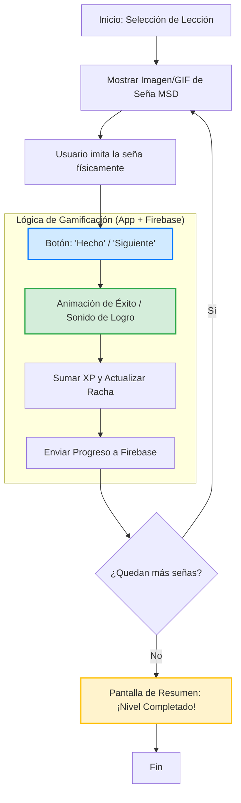

```mermaid
  graph TD
    A[Inicio: Selección de Lección] --> B[Mostrar Imagen/GIF de Seña MSD]
    B --> C[Usuario imita la seña físicamente]
    C --> D[Botón: 'Hecho' / 'Siguiente']
    
    subgraph "Lógica de Gamificación (App + Firebase)"
        D --> E[Animación de Éxito / Sonido de Logro]
        E --> F[Sumar XP y Actualizar Racha]
        F --> G[Enviar Progreso a Firebase]
    end

    G --> H{¿Quedan más señas?}
    H -- Sí --> B
    H -- No --> I[Pantalla de Resumen: ¡Nivel Completado!]
    I --> J[Fin]

    style D fill:#d1eaff,stroke:#007bff,stroke-width:2px
    style E fill:#d4edda,stroke:#28a745,stroke-width:2px
    style I fill:#fff3cd,stroke:#ffc107,stroke-width:2px

```