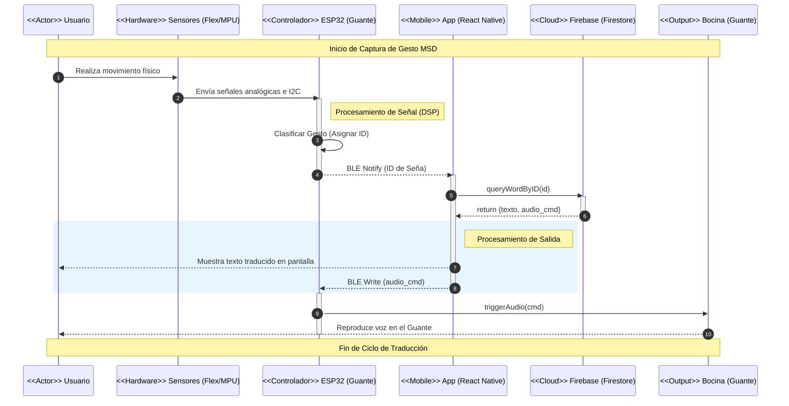

```mermaid
sequenceDiagram
    autonumber
    participant U as <<Actor>> Usuario
    participant S as <<Hardware>> Sensores (Flex/MPU)
    participant E as <<Controlador>> ESP32 (Guante)
    participant A as <<Mobile>> App (React Native)
    participant F as <<Cloud>> Firebase (Firestore)
    participant B as <<Output>> Bocina (Guante)

    Note over U, B: Inicio de Captura de Gesto MSD
    U->>S: Realiza movimiento físico
    S->>E: Envía señales analógicas e I2C
    
    activate E
    Note right of E: Procesamiento de Señal (DSP)
    E->>E: Clasificar Gesto (Asignar ID)
    E-->>A: BLE Notify (ID de Seña)
    deactivate E

    activate A
    A->>F: queryWordByID(id)
    activate F
    F-->>A: return {texto, audio_cmd}
    deactivate F

    rect rgb(230, 245, 255)
        Note right of A: Procesamiento de Salida
        A-->>U: Muestra texto traducido en pantalla
        A-->>E: BLE Write (audio_cmd)
    end
    deactivate A

    activate E
    E->>B: triggerAudio(cmd)
    B-->>U: Reproduce voz en el Guante
    deactivate E
    
    Note over U, B: Fin de Ciclo de Traducción
```