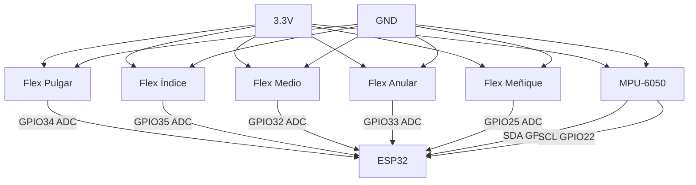

# Mapeo de pines del ESP32 DevKit V1

En este archivo se desglosa la arquitectura física del guante inteligente con el fin de definir el mapeo de pines del *ESP32 DevKit V1* para asegurar la correcta lectura de los sensores de flexión y el acelerómetro/giroscopio (MPU-6050).

| Componente | Pin ESP32 | Notas |
| - | - | - |
| Flex Pulgar | GPIO34 | ADC |
| Flex Índice | GPIO35 | ADC |
| Flex Medio | GPIO32 | ADC |
| Flex Anular | GPIO33 | ADC |
| Flex Meñique | GPIO25 | ADC |
| MPU SDA | GPIO21 | I2C |
| MPU SCL | GPIO22 | I2Cl |

---

## Diagrama de conexiones

Cada sensor flex utiliza un divisor de voltaje con resistencia de 10kΩ a GND.
